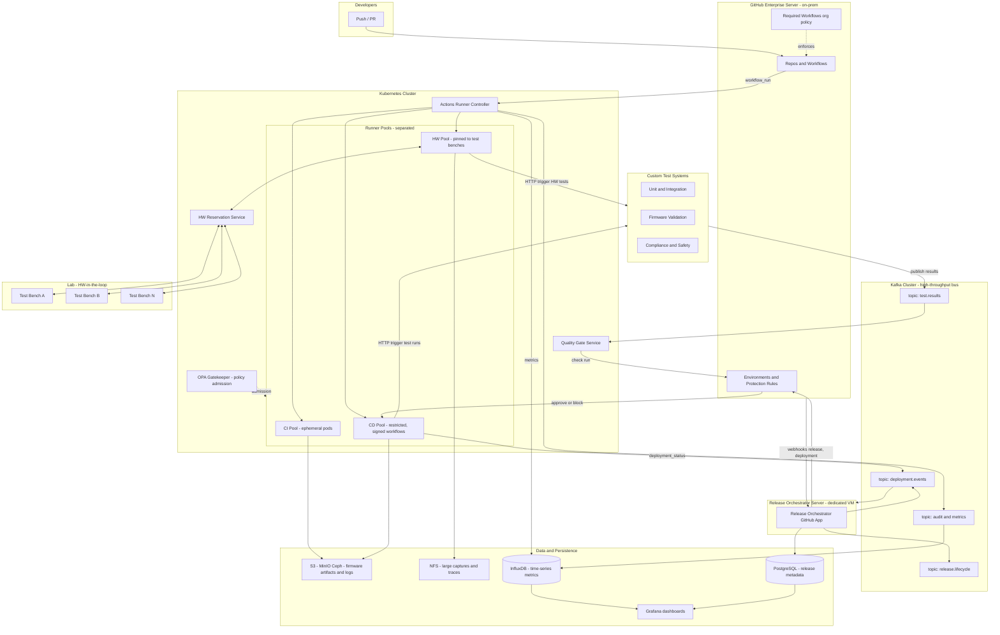

# Firmware CI/CD Architecture Plan
**Target platform:** GitHub Enterprise Server (on-prem, private network)
**Replaces:** Bitbucket + Atlassian Bamboo + Spring Boot release app
**Scale target:** 300+ developers, 5,000+ builds/day, firmware HW-in-the-loop testing

---

## 1. Executive Summary

We are replacing a heavily customized Bamboo + Spring Boot release system with a GitHub-native CI/CD platform. The new design must (a) give developers freedom to define their own pipelines, (b) prevent CI workloads from starving CD, (c) prevent runner misuse for non-CI/CD compute, (d) permanently persist CD/release results for analytics, and (e) enforce release-gating criteria sourced from existing custom test systems.

The architecture rests on six pillars:

1. **GitHub Enterprise Server (GHES)** as the SCM and workflow engine.
2. **Actions Runner Controller (ARC) on Kubernetes** with strictly separated runner pools (CI / CD / HW-in-the-loop) and per-team namespaces with ResourceQuotas.
3. **A Release Orchestrator GitHub App on a dedicated server** (the host that previously ran the Spring Boot app, or a fresh VM) — sits outside Kubernetes for blast-radius isolation from the runner platform.
4. **An Apache Kafka cluster** as the high-throughput message bus connecting GitHub Actions, custom test systems, the Quality Gate Service, the Release Orchestrator, and analytics consumers — decouples producers from consumers and absorbs bursts.
5. **A Quality Gate Service** that consumes test results from Kafka and publishes commit/deployment statuses that GitHub's Environment protection rules consume. **GitHub Action workflows trigger** the custom test systems directly; the test systems publish results back through Kafka.
6. **A Results & Analytics Pipeline** persisting artifacts to S3-compatible storage (MinIO/Ceph), structured metadata to PostgreSQL, large captures to NFS, and metrics to InfluxDB/Prometheus.

---

## 2. Requirements & Constraints

| # | Requirement | Source |
|---|---|---|
| R1 | Developers can author their own CI workflows (flexibility) | User: "flexible system that developers can create their private pipelines" |
| R2 | Heavy CI users cannot starve CD resources | User concern |
| R3 | Runners cannot be used for non-CI/CD compute | User concern |
| R4 | CD/release results persist permanently for future analysis | User concern |
| R5 | CD release blocked if criteria not met | User concern |
| R6 | HW-in-the-loop test benches integrate with pipelines (replicate Bamboo pinning) | User: "Bamboo agents pinned to HW" |
| R7 | All components run on private corporate network | Project context |
| R8 | Replace Spring Boot release app entirely with GitHub-native solution | User answer |

**Available infrastructure** (confirmed): on-prem Kubernetes, MinIO/Ceph (S3-compatible), NFS/SMB, PostgreSQL/MySQL, InfluxDB + Prometheus + Grafana, custom in-house test result systems.

---

## 3. High-Level Architecture

---

## 4. Component Design

### 4.1 GitHub Enterprise Server (GHES)
The system of record for code, workflows, and release events. Key features leveraged:

- **Repos and reusable workflows** for shared CI patterns.
- **Environments** (`dev`, `qa`, `staging`, `production-firmware`) with required reviewers and protection rules — the primary CD blocking mechanism (R5).
- **Required Workflows** at the org level — guarantees every repo runs the security / compliance gates we mandate, regardless of what developers add to their own workflows (supports R1 + R3).
- **GitHub App** for the Release Orchestrator service — uses installation tokens scoped per repo.
- **OIDC tokens** issued by GHES to runners, enabling keyless auth to S3/Postgres/HW reservation service.

### 4.2 Runner Infrastructure — Actions Runner Controller (ARC) on Kubernetes

ARC is the canonical Kubernetes operator for GitHub Actions self-hosted runners. It autoscales runners as ephemeral pods, which solves R3 (each job runs in a fresh pod that is destroyed after — no persistent state to abuse for crypto-mining or general compute) and lets us enforce hard resource ceilings.

**Three distinct RunnerScaleSets (pools):**

| Pool | Labels | K8s Namespace | Triggered by | Resource Profile |
|---|---|---|---|---|
| CI Pool | `ci`, `linux-x64` | `runners-ci-<team>` | PR and push events on feature branches | CPU/mem capped per pod; ResourceQuota per team namespace |
| CD Pool | `cd`, `release` | `runners-cd` | Only `release` events and `deployment` events; protected by `RequiredWorkflows` | Reserved capacity, never preempted by CI |
| HW Pool | `hw-bench-<id>`, `firmware-<product>` | `runners-hw` | Workflows requesting specific bench label | Pinned via nodeSelector to nodes physically wired to test benches |

Separating CI and CD into independent ARC RunnerScaleSets — and into separate K8s node pools — guarantees a runaway CI build storm cannot consume the capacity reserved for releases (R2). The CD pool's RunnerSet has a minimum-replica floor so a release can always start immediately.

**Per-team quotas (R2):** Each team gets its own CI namespace with a `ResourceQuota` (e.g., 32 vCPU, 128 GiB RAM, max 20 concurrent runner pods). Heavy teams configure their own limits within their cap; they cannot exceed it.

**Custom runner images:** Maintained centrally, hardened, with only approved toolchains. Built nightly, signed with cosign, pulled from an internal registry. This is how we prevent R3 — a developer cannot install arbitrary tooling on the runner; if they need something new, they raise a PR against the runner image repo.

### 4.3 Release Orchestrator (dedicated server, replaces Spring Boot app)

A GitHub-native service that owns the release lifecycle. Hosted on a **dedicated server** (the same VM that previously ran the Spring Boot release app, or a fresh equivalent VM) — explicitly **not** in the Kubernetes runner cluster. This separation is intentional:

- **Blast-radius isolation.** A K8s cluster issue (upgrade, networking, ARC bug) cannot also bring down the release control plane. The orchestrator can still record release state and serve audits even if runners are unavailable.
- **Stable network identity.** The orchestrator has a fixed hostname/IP for GHES webhook delivery and inbound calls from operators — no churn from pod restarts.
- **Lift-and-shift path.** If the team keeps Spring Boot expertise (Java) the new service can ship on the same host, reusing existing OS configuration, monitoring agents, and backup policy.

**Composition:**

- A **GitHub App** installed org-wide (`deployments`, `statuses`, `checks`, `actions` permissions).
- A backend service (Java / Spring Boot is acceptable; Go also a fine choice for a fresh build).
- State stored in PostgreSQL (the same schema the legacy Spring Boot app used can be migrated forward).
- Consumes from and produces to the **Kafka cluster** (topics `release.lifecycle`, `deployment.events`) so it scales horizontally and integrates with downstream analytics without point-to-point coupling.

**Responsibilities:**

1. Listen to `release.published` and `deployment.created` webhooks from GHES.
2. Create a `firmware_release` row in PostgreSQL with metadata (commit SHA, version, target HW, requester).
3. Publish a `release.lifecycle` event to Kafka.
4. Create a GitHub **Deployment** against the `production-firmware` Environment — this triggers the protection rules and required reviewers.
5. Consume `deployment.events` from Kafka (emitted by CD runners) and `check_run` results from CI and the Quality Gate Service.
6. When all gates pass, mark the deployment `success` and confirm artifacts in S3 are tagged with retention policy `compliance-7y`.
7. Expose a small read API + Grafana dashboards over the `firmware_release` table.

This is intentionally smaller than the legacy Spring Boot app because the orchestration logic (which Python scripts in Bamboo encoded opaquely) is now expressed as **transparent, version-controlled YAML workflows** that developers can read.

### 4.4 Quality Gate Service (CD blocking — R5)

A standalone service whose only job is to translate test results into GitHub commit statuses / check runs / deployment reviews.

**Flow:**

1. The CD or HW GitHub Actions workflow **explicitly triggers** the relevant custom test systems via authenticated HTTP calls (e.g., `POST https://firmware-validation.internal/runs`). The workflow passes the release ID, commit SHA, target HW, and a callback correlation ID.
2. Each custom test system runs its suite asynchronously and **publishes results to the Kafka topic `test.results`** when finished. Results carry the correlation ID so consumers can join them to the release.
3. QGS consumes `test.results` from Kafka and evaluates them against the **release criteria policy** (a YAML doc per product line, stored in a `release-policies` repo — versioned, reviewed).
4. QGS calls the GitHub Checks API to publish a check run with `conclusion: success | failure` on the release commit.
5. The `production-firmware` Environment has a required check on `qgs/release-criteria` — if it's not `success`, the deployment is **automatically blocked** by GitHub's own protection rules. No Spring Boot logic needed.

**Why pull (Kafka) instead of push (HTTP webhook)?** With 300+ developers and 5,000+ builds/day, test result volume bursts unpredictably. Kafka decouples test systems from QGS, absorbs bursts, lets us add more QGS replicas, and gives analytics and audit a copy of the same stream — without test systems needing to know about new consumers.

**Why GitHub-triggered tests instead of always-on test pipelines?** It puts each workflow in full control of which test systems matter for its release path, and keeps the test inventory readable as code in the workflow file. The workflow can also wait on the resulting check run before declaring success.

**Why this design is fail-safe:** The blocking is enforced by GitHub itself, not by our service. If the QGS is down or Kafka is congested, the check never turns green and the gate stays closed. The policy YAML makes the criteria explicit and auditable.

### 4.5 HW-in-the-Loop Runners (R6)

The Bamboo "agents pinned to HW" model maps cleanly onto ARC with custom node labels:

- Each physical test bench node in K8s gets a label like `firmware.corp/bench=bench-A-04` and a taint so only HW workloads land there.
- ARC RunnerScaleSet for the HW pool uses a `template.spec.nodeSelector` to bind runners to specific benches.
- A workflow that needs HW declares `runs-on: [self-hosted, hw-bench, firmware-productX]`.

**HW Reservation Service:** Because benches are scarce and jobs queue, a small reservation service in front of the HW pool handles fairness. The runner's job calls `hwres acquire --bench=bench-A` at the start of the job and `hwres release` at the end. This prevents two simultaneous jobs from clobbering the same bench, and provides telemetry on utilization.

### 4.6 Kafka Message Bus (high-throughput backbone)

An on-prem [Apache Kafka](https://kafka.apache.org/) cluster (3–5 brokers) is the asynchronous backbone connecting Actions runners, custom test systems, the Release Orchestrator, the Quality Gate Service, and analytics consumers. It exists because, at 5,000+ builds/day plus per-step test results, point-to-point HTTP between components becomes a coupling and capacity nightmare — bursts overwhelm receivers, downtime in one component blocks the pipeline, and adding new consumers (analytics, audit, ML) means changing every producer.

**Core topics:**

| Topic | Producers | Consumers | Retention |
|---|---|---|---|
| `test.results` | Custom test systems | Quality Gate Service, Analytics, Audit | 14 days hot, archived to S3 |
| `deployment.events` | CD runners, Release Orchestrator | Release Orchestrator, Grafana exporter, Audit | 30 days |
| `release.lifecycle` | Release Orchestrator | Analytics, BI, Audit | 90 days |
| `audit` | All services (auth, policy, gate decisions) | SIEM, long-term audit store | 7 years (archived) |
| `metrics.runners` | ARC exporter | InfluxDB sink | 7 days |

**Why Kafka specifically:** persistent log semantics (consumers can replay), high throughput, mature on-prem story (no SaaS dependency on a private network), and broad ecosystem support — Kafka Connect can sink results directly to S3 / PostgreSQL / InfluxDB without writing glue code. A managed alternative such as [Redpanda](https://redpanda.com/) is wire-compatible with Kafka and lighter to operate; the architecture choice is independent of the brand.

**Schema discipline:** Every topic has a registered schema in [Confluent Schema Registry](https://docs.confluent.io/platform/current/schema-registry/index.html) (or [Apicurio](https://www.apicur.io/registry/) — both run on-prem). Avro/Protobuf — not free-form JSON — so consumers (especially QGS) can rely on field shapes.

**Failure modes:** Producers buffer locally with exponential backoff if Kafka is unreachable; consumers commit offsets only after successful processing. QGS uses idempotent processing so a replay never produces a duplicate check run.

### 4.7 Data & Persistence Layer (R4 — permanent CD results)

| Data | Store | Retention |
|---|---|---|
| Firmware binaries, signed manifests | S3 (MinIO/Ceph) bucket `firmware-releases` | 7 years, immutable (object lock) |
| Build logs, raw test outputs | S3 bucket `build-artifacts` | 1 year, then Glacier-equivalent |
| Large HW captures, oscilloscope traces, logs | NFS `/labdata/<product>/<release>` | 2 years, then archived |
| Release metadata, gate results, approvals | PostgreSQL `firmware_release`, `gate_result`, `approval` | Indefinite |
| Runner utilization, queue depth, build duration | InfluxDB / Prometheus | 90 days hot, downsampled forever |
| Dashboards | Grafana | n/a |

A reusable `actions/upload-firmware-release@v1` composite action handles uploads in a uniform, signed manner. CD workflows are required (via `RequiredWorkflows`) to call this action so we cannot have a "release" that didn't persist its artifacts.

### 4.8 Policy & Governance (R3)

Several layers prevent runner misuse:

1. **Ephemeral pod runners** — no persistent state survives a job.
2. **Hardened runner image** — only approved toolchains; no `apt install` at runtime.
3. **NetworkPolicy** on runner namespaces — egress allowlist only to GHES, the internal registry, MinIO, and approved internal services. Public internet is blocked. (Crypto-mining is impossible without outbound.)
4. **OPA / Gatekeeper admission** — denies pods that request capabilities outside the runner profile.
5. **`RequiredWorkflows` audit** — every workflow run starts with a centrally-defined policy job that fails the run if the workflow file matches anti-patterns (e.g., long-running `sleep`, suspicious binaries).
6. **Per-team chargeback dashboards** in Grafana — visibility drives self-regulation even without hard billing.

---

## 5. Resolving Each Stated Concern

| Concern | How the architecture addresses it |
|---|---|
| Heavy CI users starving CD resources | Separate ARC RunnerScaleSets on separate K8s node pools; CD has a reserved minimum-replica floor; per-team ResourceQuotas on CI namespaces |
| Runners abused for non-CI/CD compute | Ephemeral pods + hardened image + egress NetworkPolicy + Gatekeeper admission + RequiredWorkflows policy |
| CD results not persisted for analysis | S3 (artifacts), NFS (large captures), PostgreSQL (metadata) — all written by a required composite action; 7-year retention with object lock |
| CD blocked if criteria not met | GitHub Environment protection rule requires the `qgs/release-criteria` check; QGS owns the policy and publishes the check status; fail-safe (no status = blocked) |
| HW-pinned execution (replacing Bamboo) | ARC runners on labeled+tainted K8s nodes wired to benches; HW Reservation Service for fair queuing |
| Developer flexibility | Anyone can author workflows in their repo; constraints are applied by org-level RequiredWorkflows and the runner labels they're allowed to request |
| On-prem / private network | GHES, ARC, MinIO, Postgres, Grafana, QGS, HW Reservation all on internal K8s; no public dependencies |

---

## 6. Migration Strategy (Bamboo + Spring Boot → GitHub)

A staged rollout — do **not** big-bang. Two-track migration over ~6–9 months:

**Phase 0 — Foundation (4–6 weeks).** Stand up GHES, ARC, the CI pool with one pilot team, the runner image pipeline, MinIO buckets, Grafana dashboards. Build the reusable workflows library.

**Phase 1 — CI parity (6–8 weeks).** Migrate one product line's CI from Bamboo to GitHub Actions. The opaque Python scripts in Bamboo plans must be decomposed into transparent reusable workflows or composite actions. Run Bamboo and Actions in parallel for two release cycles.

**Phase 2 — CD + Orchestrator (8–10 weeks).** Stand up the Release Orchestrator GitHub App, QGS, and HW Pool. Migrate one product line's release flow. Decommission that product line's Spring Boot release path. Keep the Postgres schema; just point the new Orchestrator at it.

**Phase 3 — Scale-out (rolling).** Onboard remaining teams one at a time, each cutover gated by their custom test systems being wired into QGS.

**Phase 4 — Decommission.** Retire Bamboo and the Spring Boot app once the last product line has moved.

---

## 7. Key Risks & Mitigations

| Risk | Likelihood | Impact | Mitigation |
|---|---|---|---|
| Opaque Bamboo Python scripts hide undocumented behavior | High | High | Phase 1 audit task: every script gets decomposed and documented before being re-implemented as a reusable workflow. Treat this as the riskiest unknown. |
| Custom test systems' result formats vary | Med | Med | QGS exposes a stable JSON schema; each test system writes a thin adapter |
| HW bench availability becomes the bottleneck | Med | High | HW Reservation Service emits queue-depth metrics to Grafana; visibility drives capacity decisions |
| GHES outage halts all builds | Low | High | GHES HA + DR runbook; runners can drain in-flight jobs; release Orchestrator queues retries |
| Developers route around RequiredWorkflows | Low | Med | Org-level required workflows cannot be bypassed by repo admins; audit log alerting on workflow policy edits |
| Storage cost growth (7y retention) | High | Low | Tiered: hot S3 → cold object store after 1y; large captures go to NFS not S3 |

---

## 8. Open Questions for Next Round

Before turning this plan into a project charter, the following need decisions:

1. **GHES HA topology** — single-instance vs. clustered (impacts DR RTO).
2. **Runner image governance owner** — Platform team vs. each product team contributing layers.
3. **Release Orchestrator language** — keep Spring Boot expertise (Java) or rewrite in Go for K8s-native footprint.
4. **QGS policy authoring** — who owns the per-product YAML release criteria?
5. **Existing custom test systems' API surface** — do they push, or do we poll? Drives QGS adapter design.
6. **HW reservation: build vs. buy** — is there a vendor scheduler (e.g., LabGrid, internal tool) we should integrate with rather than write one?
